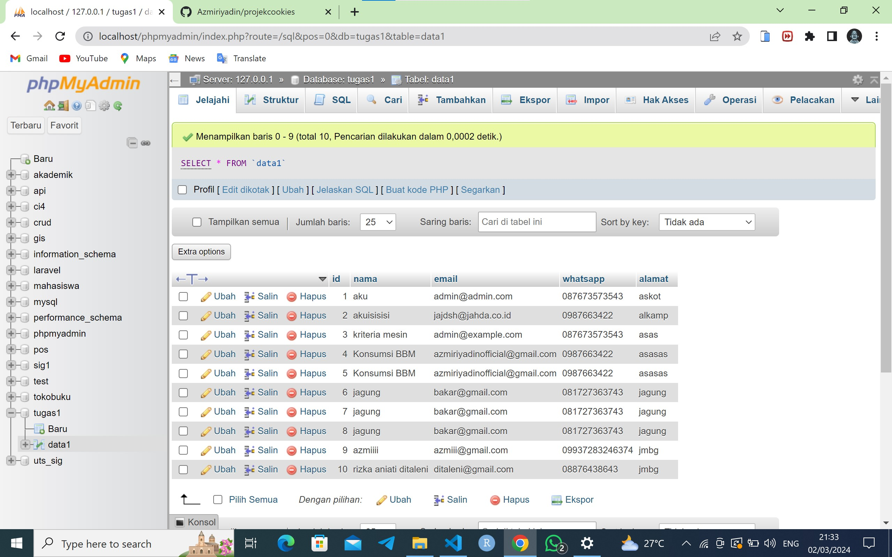
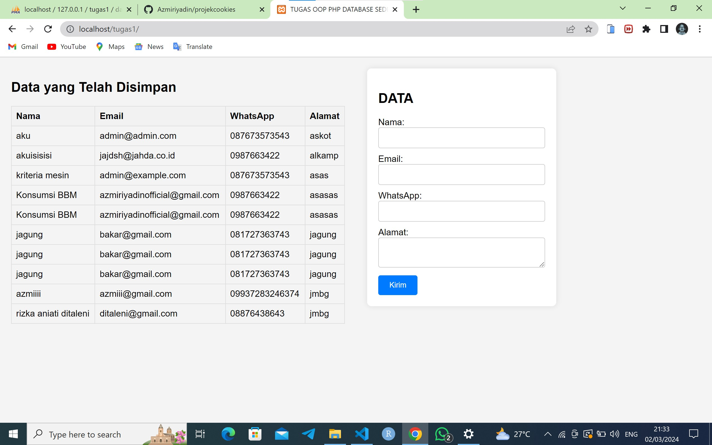

# Projek PHP OOP terkoneksi dengan Database MySQL 

Proyek ini adalah contoh implementasi sederhana dari penggunaan PHP untuk membuat sebuah form isian yang menyimpan data ke dalam database MySQL. Data yang telah tersimpan akan ditampilkan kembali di web.

## Fitur

- Form isian untuk mengumpulkan data.
- Penyimpanan data ke dalam database MySQL.
- Menampilkan data yang tersimpan di web.

## Cara Menggunakan

1. Pastikan Anda memiliki server web yang mendukung PHP dan MySQL.
2. Import file `database.sql` ke dalam database MySQL Anda.
3. Konfigurasi koneksi database MySQL Anda di file `koneksi.php`.
4. Buka browser dan akses `localhost/namafolder` untuk melihat halaman form isian.
5. Isi form dengan data yang diminta dan klik tombol "Simpan".
6. Data yang dimasukkan akan disimpan ke dalam database dan ditampilkan di web.

## Contoh Implementasi

Anda bisa melihat contoh implementasi di file [index.php](index.php).

## Bukti Hasil Proyek

## projek ini dibuat oleh

M AZMI ZAMZAMI RIYADIN
